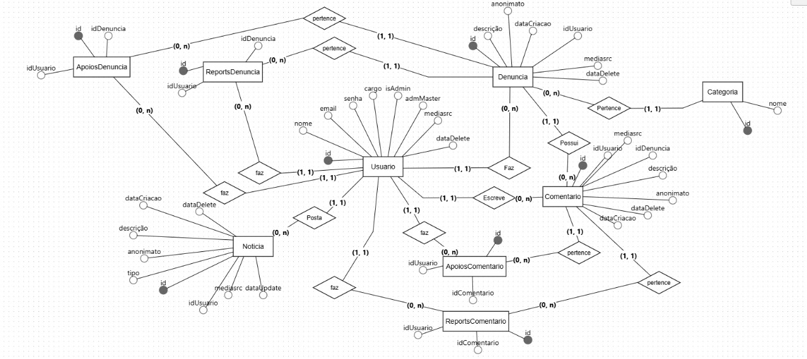

# Representação Arquitetural

## Descrição da Estrutura do Sistema

O sistema seguirá uma arquitetura **Cliente-Servidor (Client-Server)**. Esta arquitetura é organizada em um formato de **único repositório (Monorepo)**, que gerencia duas aplicações principais e independentes:

1. **Cliente (Front-end):** Uma aplicação Web de interface do usuário (UI/UX), desenvolvida em **Next.js (React)**.

2.	**Servidor (Back-end):** Uma aplicação de lógica de negócio e dados, desenvolvida em NestJS **(Node.js)**.

O Servidor (Back-end) é implementado como um **Monolíto Modular**. Isso significa que é uma aplicação única e coesa, mas internamente organizada em módulos de domínio independentes (ex: denuncias, usuarios, auth), alinhando-se ao padrão de **Arquitetura em Camadas (Layered Architecture)**.

A comunicação entre o Cliente e o Servidor ocorre exclusivamente através de uma interface de API bem definida, seguindo o padrão **REST (Representational State Transfer)**, com troca de dados no formato JSON.

---

## Justificativa das Tecnologias Adotadas

A escolha pela arquitetura Cliente-Servidor foi uma decisão deliberada para atender aos requisitos funcionais e não funcionais do projeto Guardiões da Universidade.

A justificativa detalhada baseia-se nos seguintes pilares:

1.	**Separação Estrita de Responsabilidades:** Esta é a principal vantagem. A arquitetura permite uma divisão clara entre a **camada de apresentação (Cliente)** e **a camada de lógica de negócio (Servidor)**.
    - **Front-end (Next.js)**: Foca exclusivamente na experiência do usuário (UX) e na interface (UI). Isso é crucial para atender aos Requisitos Não Funcionais de Usabilidade, como “*Interface Intuitiva*” e “*Responsividade*”. O front-end não contém regras de negócio ou acesso direto ao banco de dados.
    - **Back-end (NestJS)**: Foca exclusivamente na segurança, regras de negócio e persistência de dados. Isso é vital para cumprir os requisitos de “*Segurança e Privacidade*”, como Criptografia de Senhas, e “*Conformidade Legal*”, como a Lei Geral de Proteção de Dados Pessoais (LGPD).

2.	**Flexibilidade Tecnológica e Foco:** A separação permite escolher a melhor ferramenta para cada trabalho.
    - **Next.js** foi escolhido para o front-end por sua alta performance na renderização de interfaces React e seu ecossistema estruturado, atendendo ao requisito de “*Responsividade*”.
    - **NestJS** foi escolhido para o back-end por ser um framework opinativo e modular, que força uma organização de código limpa (Controllers, Services), facilitando a manutenção, evolução e a implementação de padrões de segurança.

3. **Desenvolvimento Paralelo e Manutenibilidade:**
    - Com a **API REST** servindo como um "contrato" estável entre o back-end e o front-end, permitindo que ambas as equipes trabalhem de forma paralela e independente sem bloquear uma à outra, otimizando o tempo de desenvolvimento.
    - A organização do back-end em um **Monolíto Modular** foi preferida em vez de microserviços. Considerando o escopo atual do projeto, outras arquiteturas mais complexas como microserviços introduziriam uma complexidade operacional desnecessária (como o gerenciamento de múltiplos serviços e comunicações em rede). O monolíto modular oferece uma excelente separação lógica de domínios, por exemplo, módulos de *Denúncias e Autenticação*, garantindo a qualidade do código sem a sobrecarga de um sistema distribuído.

4.	**Escalabilidade Independente:** A arquitetura permite que o servidor e o cliente sejam escalados de forma independente. Se a plataforma receber um grande número de denúncias, podemos escalar apenas a aplicação back-end para lidar com mais requisições, sem afetar a aplicação front-end.

---

## Especificação Técnica

A arquitetura Cliente-Servidor do sistema "*Guardiões da Universidade*" é composta por três componentes principais: o Cliente (Front-end), o Servidor (Back-end) e o Banco de Dados. A aplicação é desenvolvida em um formato de Monorepo, que aloja as aplicações do Cliente e do Servidor no mesmo repositório, facilitando o desenvolvimento e o compartilhamento de tipos.

### Componentes da Arquitetura:

1.	**Cliente (Front-end):**
    - **Tecnologia: Next.js (React)**.
    - **Responsabilidade:** Camada de apresentação, sendo a única interface direta com o usuário. É responsável por renderizar todas as telas, gerenciar o estado da interface (UI/UX) e lidar com a interação do usuário, não contém lógica de negócio crítica. Suas funções incluem atender aos requisitos de “*Usabilidade*”, como “*interface intuitiva*” e “*responsividade*”. A comunicação com o back-end é realizada via protocolos HTTP, utilizando Axios para requisições.
    - **Instanciação:** Representa a aplicação front-end localizada na pasta `/Front` do repositório.

2.	**Servidor (back-end):**
    - **Tecnologia: NestJS (Node.js)**.
    - **Responsabilidade:** É o núcleo da aplicação, responsável por toda a lógica de negócio, segurança e persistência de dados. Ele implementa a **API REST** consumida pelo usuário e segue internamente um padrão de **Arquitetura em Camadas** (Controllers, Services, Model) para garantir a separação de responsabilidades e atender ao requisito de “*Manutenção e Evolução*”. É também responsável por implementar todos os requisitos funcionais e de segurança, incluindo **criptografia de senhas**
    - **Instanciação:** Representa a aplicação contida na pasta `/Back` do repositório, organizada em módulos conforme a arquitetura definida.

3.	**Banco de Dados (Database):**
    - **Tecnologia: PostgreSQL**, acessado por meio do ORM **Prisma**.
    - **Responsabilidade:** É a camada de **persistência de dados**. É responsável por armazenar e recuperar todas as informações, incluindo usuários, denúncias, comentários, entre outros. O **Prisma ORM** garante o acesso tipado, seguro e consistente aos dados, facilitando a manutenção e reduzindo a possibilidade de erros.

### Comunicação:

A comunicação entre o Cliente e o Servidor é feita exclusivamente através de uma **API REST** sobre o protocolo **HTTP**, usando Axios. O Cliente (Next.js) envia requisições HTTP (GET, POST, PATCH, DELETE) para os endpoints definidos no Servidor (NestJS). O Servidor processa a requisição, interage com o Banco de Dados (se necessário) e retorna uma resposta no formato **JSON**.

---

## Tecnologias Utilizadas

O sistema Guardiões da Universidade utiliza um conjunto de tecnologias modernas focadas em escalabilidade, separação de responsabilidades e uma experiência de desenvolvimento robusta e manutenível:

### Ferramentas de Suporte ao Desenvolvimento:

- **GitHub**: Utilizado para o versionamento do código-fonte, seguindo uma estratégia de **Monorepo** que aloja os códigos do Back-end e Front-end em um único repositório.
- **Zenhub**: Plataforma de gerenciamento de projetos integrada ao GitHub. É utilizada para organizar o Backlog do Produto, planejar as Sprints (Milestones) e acompanhar o fluxo de trabalho da equipe no Quadro de Tarefas.
- **Jest**: Framework de testes de JavaScript, utilizado para a criação de testes unitários e de integração, garantindo o cumprimento do requisito de testes.

### Design e Front-end:

- **Figma**: Ferramenta de design colaborativo utilizada para a prototipação de baixa e alta fidelidade das telas (UI/UX), planejamento visual do roadmap e criação de diagramas de arquitetura.
- **Next.js**: O framework React escolhido para o desenvolvimento do **Cliente (front-end)**. É responsável por toda a camada de apresentação (UI/UX), gerenciamento de estado da interface e o roteamento das páginas.
- **React**: Biblioteca JavaScript fundamental para a construção de interfaces de usuário componentizadas e reativas.
- **Axios/Fetch**: Clientes HTTP utilizados no front-end para realizar a comunicação e o consumo da **API REST** exposta pelo back-end.

### Back-end

- **NestJS**: Framework Node.js escalável e modular escolhido para a construção do **Servidor (back-end)**. Ele organiza a lógica de negócio em uma Arquitetura em Camadas (Controllers, Services).
- **Prisma**: ORM (Object-Relational Mapper) moderno, utilizado para fazer a interface segura e tipada entre a aplicação NestJS e o banco de dados PostgreSQL.
- **PostgreSQL**: Banco de dados relacional escolhido para a persistência e armazenamento de todos os dados da aplicação, como usuários, denúncias e comentários.
- **JWT (JSON Web Tokens)**: Padrão utilizado para a autenticação e autorização da API. Garante que endpoints protegidos só possam ser acessados por usuários autenticados.
- **Bcrypt**: Biblioteca para hashing de senhas, garantindo que as senhas dos usuários sejam armazenadas de forma criptografada e segura, em conformidade com o requisito de segurança.

---

## Metas e restrições arquiteturais

As metas e restrições arquiteturais são derivadas diretamente dos Requisitos Não Funcionais (RNFs) definidos no documento de requisitos do projeto. Eles atuam como diretrizes e restrições que moldam as escolhas de design e tecnologia.

### Metas Arquiteturais baseadas nos RNFs:

- **Usabilidade**:
    - A arquitetura do front-end deve possibilitar a construção de uma interface intuitiva, garantindo que os fluxos críticos (como denúncia e cadastro) possam ser concluídos em até **quatro etapas**.
    - O sistema deve ser **totalmente responsivo**, assegurando adaptação automática a diferentes resoluções e tamanhos de tela, incluindo desktops, tablets e dispositivos móveis.

- **Manutenção e Evolução:**
    - O código-fonte deve seguir padrões de **clean code** para ser legível e fácil de manter.
    - A arquitetura do sistema deve ser devidamente **documentada**, incluindo descrições de endpoints, fluxos e componentes arquiteturais.

- **Segurança e Conformidade Legal:**
    - A arquitetura deve garantir que todas as senhas sejam armazenadas utilizando um **algoritmo de hash seguro**, assegurando que nenhuma senha seja gravada em texto plano.
    - A arquitetura deve ser compatível com a **LGPD**, garantindo o consentimento do usuário e a capacidade de exclusão de dados.

### Restrições Arquiteturais:

- **Tecnologia do Back-end:** O back-end será desenvolvido exclusivamente com o framework **NestJS (Node.js)**.
- **Tecnologia do Front-end:** O front-end será desenvolvido exclusivamente com o framework **Next.js (React)**.
- **Banco de Dados:** A camada de persistência utilizará o **PostgreSQL** como sistema de gerenciamento de banco de dados, com o **Prisma** como ORM.

---

## Backlog do Produto (Escopo do Produto)

O funcionamento geral do sistema "*Guardiões da Universidade*" consiste em fornecer um canal duplo: um voltado **denúncias e interações da comunidade** e outro dedicado a **orientações formais**.

Os usuários podem se cadastrar, autenticar-se, publicar denúncias (de forma anônima ou identificada), além de comentar e reagir às postagens de outros membros. Paralelamente, têm acesso a uma área de orientações institucionais, com guias e links para os canais oficiais da universidade.

Administradores dispõem de uma interface de **moderação e gerenciamento**, permitindo o controle de conteúdo e de usuários.

Diversos requisitos do **Backlog do Produto** influenciaram diretamente a adoção de uma arquitetura Cliente-Servidor, com um back-end modular, favorecendo a escalabilidade, a segurança e a independência entre as camadas do sistema.

Essas decisões podem ser compreendidas a partir dos principais **requisitos do Backlog do Produto**, destacados a seguir:

1. **Requisitos de Segurança e Domínios Separados:** Considerando necessidade de funcionalidades críticas, como *Autenticação de Conta e Administração*, justificou a implementação de um back-end completo responsável por centralizar e proteger essa lógica, mantendo-a isolada da interface do usuário.

2. **Requisitos de Usabilidade:** A forte ênfase em uma *Interface Intuitiva* e *Responsividade*, justificou o uso de um framework de front-end moderno e dedicado (Next.js), o que é um pilar da arquitetura Cliente-Servidor.

3. **Requisitos de Manutenibilidade:** O requisito de *Qualidade do Código* influenciou a escolha do NestJS para o back-end, uma vez que sua arquitetura modular permite a criação de um monólito organizado por domínio, facilitando a manutenção e a evolução do sistema em comparação a uma abordagem baseada em microserviços, considerada excessiva para o escopo deste projeto.

4. **Experiência da Equipe:** A familiaridade da equipe com o ecossistema JavaScript/TypeScript, incluindo tecnologias como NestJS, React e Node.js, foi um fator determinante na escolha da stack. Esse alinhamento técnico permitiu um desenvolvimento mais ágil, colaborativo e eficiente, garantindo a entrega dentro dos prazos acadêmicos sem comprometer a qualidade do código.

---

## Visão lógica

A visão lógica descreve a organização interna da aplicação, seus principais componentes de software e como eles interagem. Conforme a arquitetura Cliente-Servidor definida, o sistema é subdividido em dois pacotes de software principais: a aplicação **Cliente (Front-end)** e a aplicação **Servidor (Back-end)**. Esta seção foca primariamente na visão lógica do Servidor (Back-end), que é um **Monolíto Modular** construído com NestJS.

- **Módulos do Servidor (Back-end):**
O back-end é subdividido em módulos que representam os principais domínios de negócio da aplicação. Esta abordagem garante a separação de responsabilidades e alta manutenibilidade. Os módulos principais são:
    - **app.module.ts:** O módulo raiz que importa todos os outros módulos de funcionalidade.
    - **database (ou prisma):** Módulo de infraestrutura responsável por prover a conexão com o banco de dados (PrismaService) para os outros módulos.
    - **autenticação (ou auth):** Gerencia todas as funcionalidades de autenticação, como registro, login (geração de JWT) e recuperação de senha, além de prover os Guards de segurança.
    - **usuário (ou users):** Gerencia o CRUD de usuários e a lógica de perfis.
    - **denúncias:** Gerencia o CRUD e a lógica de negócio para as denúncias.
    - **categorias:** Gerencia o CRUD dos tipos de denúncia.
    - **comentários:** Gerencia o CRUD de comentários associados às denúncias.
    - **notícias:** Gerencia o CRUD de notícias publicadas por administradores.
    - **apoios:** Gerencia a lógica para "apoiar" denúncias e comentários.
    - **reports:** Gerencia a lógica para "reportar" denúncias e comentários.

### Diagramas e Pacotes

O diagrama de pacotes a seguir ilustra como os módulos do back-end se relacionam. A principal regra de dependência é que os módulos de funcionalidade dependem do módulo de infraestrutura (database), além de algumas relações de dependências entre eles, a depender do módulo.

O diagrama de pacotes a seguir representa as relações entre os módulos do back-end. A regra principal de dependência estabelece que os módulos de funcionalidade dependem do módulo de infraestrutura, responsável pela integração com o banco de dados. Além disso, podem existir dependências secundárias entre módulos específicos, quando há compartilhamento de entidades ou serviços comuns.

### Comunicação entre Módulos:

A comunicação no sistema ocorre de duas formas distintas:

- **Comunicação Externa (Cliente -> Servidor):** Realizada exclusivamente via **API REST** sobre o protocolo HTTP. O Cliente (Next.js) envia requisições em formato JSON para os endpoints definidos nos Controllers do Servidor (NestJS) garantindo a separação clara entre interface e lógica de negócio.

- **Comunicação Interna (Módulo -> Módulo):** Implementada por meio do mecanismo de Injeção de Dependência do NestJS. Módulos que necessitam de funcionalidades de outros módulos (por exemplo, `DenunciasService` utilizando `PrismaService`) recebem essas dependências diretamente em seus constructors, mantendo a modularidade e facilitando a manutenção.

---

## Camadas:

O sistema é organizado em camadas, cada uma com responsabilidades específicas, permitindo separação de interface, lógica de negócio e persistência de dados. A seguir, são apresentadas as principais camadas da aplicação:

- **Camada de Apresentação (Interface com Usuário):** No contexto da arquitetura Cliente-Servidor, esta camada corresponde ao front-end desenvolvido em Next.js, totalmente separado do back-end. O protótipo de baixa fidelidade encontra-se disponível na aba de protótipo, servindo como referência para a interface e fluxos de usuário.

- **Lógica de Negócios e Regras de Negócio:** Esta camada reside nos **Services** do NestJS, que contêm a lógica principal do sistema, e nos **Controllers**, que funcionam como a fachada da API, recebendo requisições HTTP e delegando o processamento para os Services. Essa separação garante modularidade, manutenibilidade e clareza na implementação das regras de negócio.

- **Comunicação com o Banco de Dados:** É a camada responsável pela persistência e recuperação de informações, esta camada é gerenciada pelo **Prisma ORM**, que faz interface com o **PostgreSQL**, e encapsulada no **PrismaService** (módulo database). Os Services da camada de negócios interagem com o PrismaService, abstraindo operações SQL e garantindo consistência, segurança e integridade no acesso aos dados.

--- 

## Visão de Dados (MER)

A persistência de dados do sistema é gerida por um *banco de dados relacional** (PostgreSQL) e abstraída pela aplicação através do ORM Prisma. O **Modelo Entidade-Relacionamento (MER)** define a estrutura lógica dos dados, suas relações e restrições, garantindo consistência e integridade.

### Entidades (Tabelas):

1. **Usuario:** Armazena as informações dos utilizadores da plataforma (nome, email, senha com hash, cargo, etc.). É a entidade central para autenticação e autoria.

2. **Denuncia:** A entidade principal do sistema. Armazena o conteúdo das denúncias (descrição, mediasrc), o estado (anonimato, dataDelete) e as suas ligações.

3. **Categoria:** Armazena os tipos de denúncia (ex: "Infraestrutura", "Segurança"). Esta tabela permite que os tipos sejam geridos dinamicamente pela administração.

4. **Noticia:** Armazena as postagens informativas criadas por administradores.

5. **Comentario:** Armazena os comentários realizados pelos usuários em cada denúncia, registrando autoria, conteúdo, data e vínculo com a denúncia correspondente.

6. **ApoiosDenuncia / ReportsDenuncia (Tabelas de Junção):** Gerem as relações N-para-N (muitos-para-muitos) entre Usuario e Denuncia, permitindo que um utilizador possa apoiar ou reportar várias denúncias, e uma denúncia possa ser apoiada ou reportada por vários utilizadores.

7. **ApoiosComentario / ReportsComentario (Tabelas de Junção):** Idênticas às anteriores, mas aplicadas à entidade Comentario.

### Relações e Cardinalidades Principais:

- **Usuario 1:N Denuncia:** Um Usuario pode criar múltiplas Denuncias. Cada Denuncia pertence a apenas um Usuario.
- **Usuario 1:N Comentario:** Um Usuario pode fazer múltiplos Comentarios. Cada Comentario pertence a apenas um Usuario.
- **Denuncia 1:N Comentario:** Uma Denuncia pode ter múltiplos Comentarios. Cada Comentario está ligado a apenas uma Denuncia.
- **Categoria 1:N Denuncia:** Uma Categoria pode ser aplicada a múltiplas Denuncias. Cada Denuncia pertence a apenas uma Categoria.
- **Usuario N:N ApoiosDenuncia N:N Denuncia:** Relação de muitos-para-muitos que define os "apoios".

---

## Atributos Principais:

| Entidade | Atributo | Tipo de Dado (Prisma/PostgreSQL) | Propósito e Observações |
| :---: | :---: | :---: | :--- |
| **Usuario** | id | Int (PK) | Identificador único do usuário. |
|  | nome | String | Nome completo do usuário. |
|  | email | String | Email de login, não há um identificador unico pois aplicaremos um soft-delete. Mas o e-mail é único para usuário com dataDelete iguall a NULL |
|  | senha | String | Armazena o hash da senha. |
|  | cargo | Enum (CargoUsuario) | Define o cargo do usuário (ESTUDANTE, SERVIDOR, OUTRO). |
|  | isAdmin | Boolean | Flag booleana que indica se o usuário tem permissões de administrador. |
|  | admMaster | Boolean | Flag para o administrador "root" do sistema, com permissões máximas. |
|  | mediasrc | String? | URL para a foto de perfil do usuário. O ? indica que é opcional. |
|  | dataDelete | DateTime? | Data da exclusão lógica (Soft Delete). Se null, o usuário está ativo. |
|  |  |  |  |
| **Denuncia** | id | Int (PK) | Identificador único da denúncia. |
|  | idUsuario | Int (FK) | Chave estrangeira que referencia Usuario.id. O autor da denúncia. |
|  | descricao | String | O texto descritivo completo da denúncia. |
|  | idCategoria | Int (FK) | Chave estrangeira que referencia Categoria.id. |
|  | mediasrc | String? | URL para mídia (foto/vídeo) anexa à denúncia. Opcional. |
|  | anonimato | Boolean | Se true, a denúncia foi feita anonimamente (o idUsuario ainda é registrado, mas a UI não deve exibi-lo). |
|  | dataDelete | DateTime? | Data da exclusão lógica (Soft Delete). |
|  | dataCriacao | DateTime | Timestamp de quando a denúncia foi criada (@default(now())). |
|  | dataUpdate | DateTime | Timestamp da última atualização (@updatedAt). |
|  |  |  |  |
| **Comentario** | id | Int (PK) | Identificador único do comentário. |
|  | idUsuario | Int (FK) | Chave estrangeira que referencia Usuario.id. O autor do comentário. |
|  | idDenuncia | Int (FK) | Chave estrangeira que referencia Denuncia.id. A denúncia que está sendo comentada. |
|  | Descricao | String | O texto do comentário. |
|  | anonimato | Boolean | Se true, o comentário foi feito anonimamente. |
|  | dataDelete | DateTime? | Data da exclusão lógica (Soft Delete). |
|  | dataCriacao | DateTime | Timestamp de quando o comentário foi criado. |
|  | dataUpdate | DateTime | Timestamp da última atualização. |
|  |  |  |  |
| **Noticia** | id | Int (PK) | Identificador único da notícia. |
|  | idUsuario | Int (FK) | Chave estrangeira que referencia Usuario.id. O administrador que postou a notícia. |
|  | descricao | String | O corpo/texto da notícia. |
|  | tipo | String | Um tipo ou categoria para a notícia (ex: "Aviso", "Evento", "Manutenção"). |
|  | mediasrc | String? | URL para uma imagem de capa da notícia. Opcional. |
|  | dataDelete | DateTime? | Data da exclusão lógica (Soft Delete). |
|  | dataCriacao | DateTime | Timestamp de quando a notícia foi criada. |
|  | dataUpdate | DateTime | Timestamp da última atualização. |
|  |  |  |  |
| **Categoria** | id | Int (PK) | Identificador único da categoria. |
|  | nome | String (Unique) | Nome único da categoria de denúncia (ex: "Estrutural", "Acadêmico", "Assédio"). |
|  |  |  |  |
| **ApoiosDenuncia** | id | Int (PK) | Identificador único do registro de apoio. |
|  | idUsuario | Int (FK) | Chave estrangeira que referencia Usuario.id. O usuário que apoiou. |
|  | idDenuncia | Int (FK) | Chave estrangeira que referencia Denuncia.id. A denúncia que foi apoiada. |
|  | Atributo Implícito | @@unique(...) | Tabela de Junção (0-para-N). Garante que um usuário só pode apoiar a mesma denúncia uma vez. |
|  |  |  |  |
| **ReportsDenuncia** | id | Int (PK) | Identificador único do registro de report. |
|  | idUsuario | Int (FK) | Chave estrangeira que referencia Usuario.id. O usuário que reportou. |
|  | idDenuncia | Int (FK) | Chave estrangeira que referencia Denuncia.id. A denúncia que foi reportada. |
|  | Atributo Implícito | @@unique(...) | Tabela de Junção (0-para-N). Garante que um usuário só pode reportar a mesma denúncia uma vez. |
|  |  |  |  |
| **ApoiosComentario** | id | Int (PK) | Identificador único do registro de apoio. |
|  | idUsuario | Int (FK) | Chave estrangeira que referencia Usuario.id. O usuário que apoiou. |
|  | idComentario | Int (FK) | Chave estrangeira que referencia Comentario.id. O comentário que foi apoiado. |
|  | Atributo Implícito | @@unique(...) | Tabela de Junção (0-para-N). Garante que um usuário só pode apoiar o mesmo comentário uma vez. |
|  |  |  |  |
| **ReportsComentario** | id | Int (PK) | Identificador único do registro de report. |
|  | idUsuario | Int (FK) | Chave estrangeira que referencia Usuario.id. O usuário que reportou. |
|  | idComentario | Int (FK) | Chave estrangeira que referencia Comentario.id. O comentário que foi reportado. |
|  | Atributo Implícito | @@unique(...) | Tabela de Junção (0-para-N). Garante que um usuário só pode reportar o mesmo comentário uma vez. |

---

## Visão de Implantação

### Infraestrutura de Hardware

O software será implantado em um **Servidor Virtual Privado (VPS)** único. Esta abordagem foi selecionada para priorizar a **centralização do controle e a simplicidade operacional**. Diferentemente de arquiteturas de nuvem distribuídas a utilização de um VPS único consolida todos os recursos de software em um ambiente de fácil gerenciamento, sendo ideal para o escopo e os requisitos do projeto.

### Tecnologias de Implantação

A estratégia de implantação é fundamentada nas seguintes tecnologias:

1. **Docker (Containerização):**
    - **Descrição:** O Docker será empregado como a tecnologia central para a **containerização** (empacotamento) da aplicação (backend NestJS) e do serviço de banco de dados (PostgreSQL).
    - **Justificativa:** A containerização é essencial para garantir a **paridade entre os ambientes de desenvolvimento e produção**. Isso mitiga discrepâncias de software e configuração, resolvendo problemas comuns de implantação e garantindo que o software se comporte de maneira previsível.

2. **Docker Compose (Orquestração de Contêineres):**
    - **Descrição:** O Docker Compose será utilizado para **definir e orquestrar** a aplicação multi-contêiner.
	- **Justificativa:** Esta ferramenta automatiza e simplifica o ciclo de vida da implantação. Através de um único arquivo de definição (docker-compose.yml), o Docker Compose gerencia a construção da imagem da aplicação, o provisionamento do contêiner do banco de dados, a configuração da rede interna entre os serviços e a inicialização de todos os componentes na ordem de dependência correta.

3. Node.js (Runtime da Aplicação):
    - **Descrição:** O ambiente de execução JavaScript no lado do servidor, necessário para a execução do framework NestJS.
    - **Justificativa:** O runtime Node.js será **encapsulado** dentro da imagem Docker da aplicação. Ele não será instalado diretamente no sistema operacional do host (VPS), garantindo o isolamento das dependências, a portabilidade da imagem e a consistência do ambiente de execução.

### Infraestrutura de Banco de Dados

A infraestrutura de persistência de dados será implementada da seguinte forma:

1. **SGBD (Sistema de Gerenciamento): PostgreSQL**
    - **Descrição:** O sistema de banco de dados relacional de código aberto PostgreSQL.
    - **Justificativa:** A escolha é ditada pelo schema.prisma do projeto, que define uma estrutura de dados relacional. O PostgreSQL oferece robustez, escalabilidade e suporte avançado aos tipos de dados e relacionamentos (1-N, N-N) modelados para o sistema.

2. Infraestrutura: Contêiner Docker Co-localizado
    - **Descrição:** O SGBD PostgreSQL será executado como um contêiner Docker provisionado dentro do mesmo Servidor Virtual Privado (VPS) que a aplicação.
    - **Justificativa:** Esta abordagem representa uma alternativa economicamente eficiente e operacionalmente simples aos serviços gerenciados de Banco de Dados como Serviço (DBaaS). O Docker Compose será responsável por gerenciar o ciclo de vida do contêiner do banco de dados e a comunicação de rede entre este e o contêiner da aplicação. A string de conexão (DATABASE_URL) da aplicação NestJS referenciará o nome do serviço do banco de dados na rede interna do Docker, assegurando uma arquitetura coesa e autocontida.

---

## Restrições adicionais

Existem restrições de negócio e de qualidade de software (Requisitos Não Funcionais) que guiam o desenvolvimento e a arquitetura do sistema.

### Restrições de Negócio:

- **Acesso Controlado:** O acesso à maioria das funcionalidades críticas (criar denúncia, comentar, editar perfil) deve exigir que o utilizador esteja autenticado.
- **Canal Não-Oficial:** A plataforma deve informar os utilizadores de que se trata de um canal não-oficial da universidade, e o seu propósito principal é dar voz à comunidade e orientar para os canais competentes.

### Restrições de Qualidade de Software (Requisitos Não Funcionais):

O sistema deve aderir estritamente aos seguintes Requisitos Não Funcionais:

- **Usabilidade:**
    - A interface deve ser intuitiva, com fluxos críticos realizados em até 4 passos.
    - Ações críticas e irreversíveis (ex: cancelar denúncia) devem exigir confirmação explícita do utilizador.

- **Manutenção e Evolução:**
    - O código deve seguir padrões de clean code e ser adequadamente documentado.
    - A documentação da API e da arquitetura deve ser mantida atualizada para facilitar a integração e manutanção.

- **Conformidade Legal:**
    - O sistema deve estar em conformidade com a LGPD, apresentando uma política de privacidade clara e obtendo consentimento ativo do utilizador no cadastro.
- **Segurança e Privacidade:**
    - Todas as senhas de utilizador devem ser armazenadas no banco de dados utilizando um hash seguro.